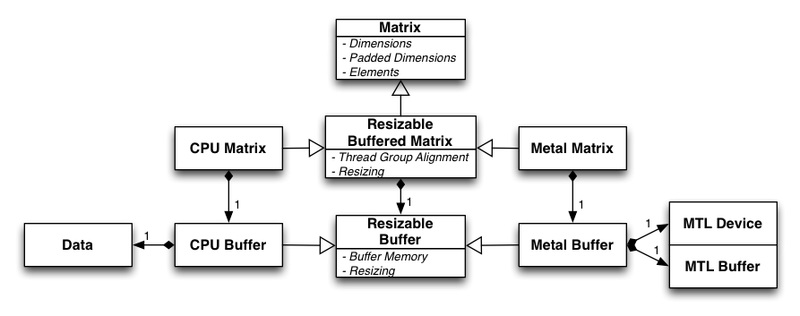
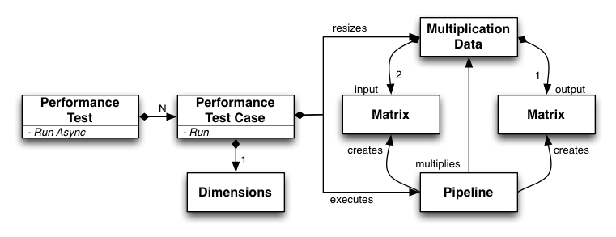

Metal Matrix Multiply
=====================
A matrix multiplication test using Metal.

### Update: Use Metal Performance Shaders Instead ###

A full suite of GPU accelerated linear algebra routines are now available on macOS 10.13 and iOS 11.

Reference: ["Using Metal 2 for Compute", WWDC 2017](https://developer.apple.com/videos/play/wwdc2017/608/?time=170)

### Details ###

This repo was an experiment derived from Apple [sample code] but rebuilt in Swift for iOS 9 and OS X 10.11.

[sample code]: https://developer.apple.com/library/ios/samplecode/MetalPartialSumsCompute

### Data Structure ###

### Test Harness ###

### License ###

MIT License, see http://opensource.org/licenses/MIT
